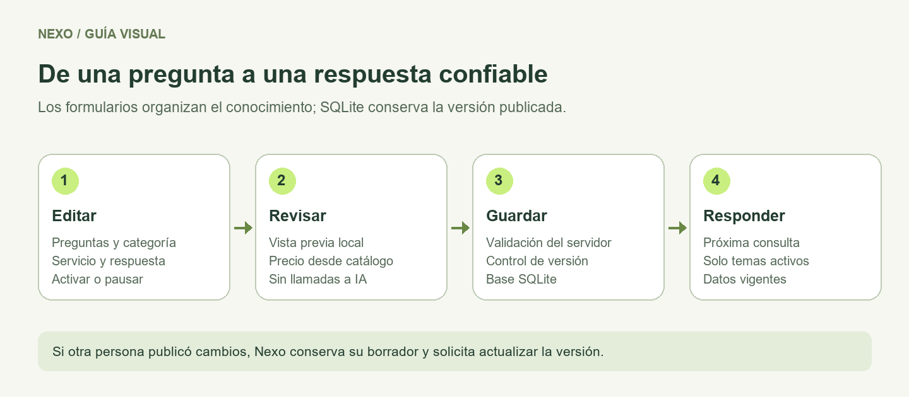
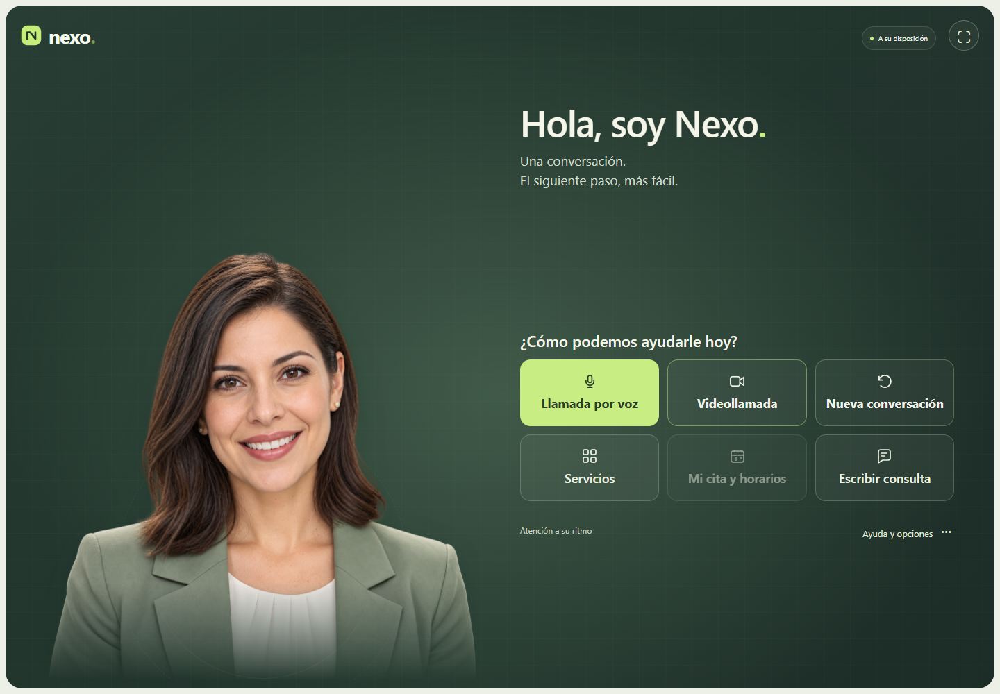

# Nexo · Kiosco conversacional para un centro de atención

## Versión actual: 0.36.2

Editor visual de preguntas frecuentes con categorías, búsqueda, vista previa y precios del catálogo. Piloto web con voz, video, agenda por profesor y administración protegida.

[Guía ilustrada del editor](docs/55-editor-visual-github.md) · [Manual junior](docs/23-manual-desarrollador-junior.md) · [GitHub y pruebas](docs/24-manual-github.md)



Repositorio: https://github.com/dafermen/nexo. GitHub Actions comprueba código, documentación y pruebas. [Primera ejecución aprobada](https://github.com/dafermen/nexo/actions/runs/36341650322): 301 pruebas por sistema y recorridos de navegador. Consulte Actions para el resultado de cada cambio. Las secciones por versión siguientes conservan antecedentes del proyecto.

## Contenido comercial aprobado

[Curso de cinco horas y libro: información, horarios y mantenimiento](docs/56-curso-libro-contenido.md). Precios, requisitos, horarios informativos, inclusiones y condiciones se editan en Administración. Las FAQ usan parámetros del catálogo; las cargas de contenido son atómicas y se aplican una sola vez.

## Historial de versiones anteriores

> **Administradores múltiples v0.25.1.** Códigos y sesiones independientes; despliegue sobre Nginx existente. [Estado real del piloto](docs/47-piloto-metodomogollon.md).

> **Piloto web Linux v0.25.0.** Acceso privado, límites del servidor, voz Linux ES/EN/FR, paquete sin datos privados y despliegue systemd/Caddy. Preparado para instalar; validación del VPS pendiente. [Guía de despliegue](docs/45-despliegue-piloto-linux.md) · [Seguridad y alcance](docs/46-seguridad-piloto.md). Capacitor/APK es una fase posterior.

> **Código explicado para estudiantes.** Cabeceras de propósito, entradas, salidas y estado en el código propio; contratos de funciones centrales y ruta educativa en el portal. [Manual junior](docs/23-manual-desarrollador-junior.md) · [Mapa de código](docs/41-mapa-codigo-fuente.md) · `npm run docs:check`.

> **Biblioteca de audio v0.24.0.** Reutilización de saludos y respuestas aprobadas por texto, idioma y voz, con límite de espacio y caducidad. Uso y vaciado en Administración. [Guía](docs/40-biblioteca-audio.md).

> **Tres idiomas v0.23.0.** Selector Español · English · Français para atención, voz, formularios y confirmaciones de nuevas reservas. [Guía y alcance](docs/39-idiomas.md).

> **Kiosco responsive v0.22.0.** Inicio de una sola pantalla en vertical u horizontal: voz, video, servicios, citas y texto dentro del mismo espacio. [Guía](docs/38-kiosco-responsive.md).

> **Orientación y revisión v0.21.0.** Conversación guiada para elegir servicios del catálogo y panel Administración → Mejorar respuestas, con borradores y aprobación explícita antes de publicar. [Manual](docs/37-orientacion-revision.md).

> **Agenda conversacional v0.20.0.** Pida una clase para un día/franja, cambie con «mejor por la mañana» y elija «la segunda». Nexo consulta horarios reales y abre el formulario; la confirmación final sigue siendo explícita. [Manual](docs/36-agenda-conversacional.md).

> **Agenda desde el inicio v0.19.1.** Pulse Clase práctica para reservar, consultar su cita o ver disponibilidad desde el mismo menú de la llamada, sin iniciar voz o video. [Guía](docs/34-reservas-calendar.md).

> **Reservas v0.19.0.** Teclado manual expandible mediante icono, en voz y video. Todos los horarios del día: disponibles verdes, ocupados rosas y horas pasadas/fuera de anticipación grises. El formulario permanece si termina el video. [Guía](docs/34-reservas-calendar.md).

> **Teclado opcional v0.18.0.** Active Configuración → Experiencia → Teclado en pantalla del kiosco para ofrecer el icono con el que cada visitante abre el teclado al escribir consultas, nombre, correo y código de reserva. Desactivado por defecto para conservar el teclado del dispositivo. [Manual](docs/35-teclado-pantalla.md).

> **Agenda y confirmaciones v0.17.1.** Durante la llamada, **Mi cita y horarios** permite reservar, consultar una cita con correo y código de ocho letras, o ver disponibilidad. Las peticiones por voz abren el formulario correspondiente. Las reservas confirmadas intentan enviar un correo mediante el SMTP configurado; el resultado del envío se muestra separado del estado de la cita. [Manual](docs/34-reservas-calendar.md).

> **Reservas v0.16.0.** Clase práctica individual de 60 minutos, lunes a viernes 08:00–18:00 (Nueva York). Formulario disponible desde Servicios o la opción Reservar y confirmar cita de la llamada por voz: día/hora, nombre/correo escritos, revisión y confirmación, código, verificación y cancelación administrativa. Reglas en Configuración → Conexiones. [Manual y límites del piloto](docs/34-reservas-calendar.md).

> **Google Calendar (v0.15.0).** Configuración → Conexiones permite autorizar una cuenta, elegir calendario y probar lectura/creación/limpieza. Conexión real a «Mogollon Method» autorizada y verificada el 26/09/2026: lectura y creación/eliminación de un evento de prueba satisfactorias. El piloto de reservas de clases prácticas está disponible; consulte la guía v0.16.0. [Guía](docs/33-google-calendar.md).

> **Historial privado (v0.14.0).** Administración → Conversaciones permite revisar preguntas y respuestas, consultar métricas y descargar cada atención como texto. SQLite conserva los registros aunque se limpie el inicio o se reinicie el servidor. [Manual](docs/32-historial-conversaciones.md).

> **SQLite y acceso por correo (v0.13.0).** Datos operativos y respuestas en SQLite, editor de respuestas y códigos temporales para Administración. Acceso por Gmail activado y primer ingreso con código verificado el 19/09/2026. [Configuración y manual](docs/31-sqlite-acceso-correo.md).

> **Configuración por negocio (v0.12.0).** En Administración → Configuración puede definir negocio, asistente, horarios, moneda, canales, cuotas de IA, respuestas propias y opciones de conexión. Una instalación atiende a un negocio; conserva MetodoMogollon por defecto. [Manual y límites](docs/30-configuracion-negocio.md).

> **Portal de documentación (v0.11.0).** En Administración → Documentación se abre la biblioteca de Nexo en una pestaña nueva. Incluye búsqueda en el contenido, manuales junior/GitHub/operación, fases, tareas y descarga. Abra http://localhost:3000/docs con el servidor encendido. [Inicio de la documentación](docs/00-inicio.md) · [Estado actual y pendientes](docs/25-fases-y-tareas.md).

> Las secciones iniciales y capturas de este README conservan la historia de la demo. El perfil actual es MetodoMogollon: **Google Calendar está conectado; las reservas de clases prácticas están habilitadas y los pagos siguen pendientes**.


> **Interpretación de consultas (v0.10.0).** Las frases dudosas pueden usar OpenAI para comprender intención, regionalismos y errores de transcripción. Las respuestas se construyen con el catálogo; interpretación y orientación comparten los límites de consumo. Voz y texto usan el mismo flujo. [Funcionamiento y pruebas](docs/22-interpretacion-intencion.md).

> **Preguntas frecuentes editables (v0.9.0).** Históricamente se editaba conocimiento/preguntas-frecuentes.txt; desde v0.13 use Administración → Respuestas frecuentes. Base inicial: 24 temas iniciales, respuestas parametrizadas con datos del catálogo y recarga sin reiniciar. Saludos y FAQs se resuelven localmente. [Guía de edición](docs/21-preguntas-frecuentes.md).

> **Conversación automática disponible (v0.8.0).** En las llamadas por voz, Nexo activa la escucha después del saludo: envía la frase, responde y vuelve a escuchar. Puede pausar o cambiar a envío manual. El chat escrito conserva Enviar. [Uso y validación](docs/20-conversacion-automatica.md).

> **Filtro escolar activo y probado (v0.7.1).** Consultas frecuentes y desvíos se resuelven localmente; orientación pertinente puede usar OpenAI con cupos de 6 solicitudes por atención y 100 al día. [Reglas, límites y alcance](docs/19-filtro-y-consumo.md).


> **Voz o video (v0.6.0).** El inicio ofrece Llamada por voz con retrato y Videollamada con LiveAvatar. Elegir voz no crea una sesión de LiveAvatar. [Funcionamiento y validación](docs/18-voz-y-video.md).


> **Administración editable disponible (v0.5.0).** Abra ABRIR-ADMIN.cmd para editar servicios, precios, requisitos, modalidades y horarios. Los datos se conservan en SQLite y se usan en la siguiente respuesta de la asesora. [Guía de acceso y funcionamiento](docs/17-administracion.md).


> **Perfil activo: MetodoMogollon (16/09/2026).** Escuela de conducción; trato de usted; atención de lunes a viernes, 08:00–18:00 (Nueva York). Servicios confirmados por el responsable; precios y requisitos pendientes. Google Calendar se conectó y verificó el 26/09/2026; el piloto de clases prácticas está habilitado. El perfil de la escuela deshabilita las reservas locales y los horarios/precios de ejemplo descritos en la demo original. [Configuración y pendientes](docs/16-metodomogollon.md).


Ubicación principal: `C:\Projects\Nexo`. Configura las claves en `.env` de esta carpeta. El origen anterior se conserva solo como respaldo. Consulta `UBICACION.md`.

**MVP local v0.20.0 · Actualizado el 26 de septiembre de 2026**

Nexo recibe a una persona, explica los servicios del centro y la acompaña hasta reservar un turno. La demo funciona en una PC. El destino acordado es un kiosco iPad: primero LiveAvatar y, en una segunda etapa, MetaHuman. [Decisión y plan de implementación](docs/14-etapas-liveavatar-metahuman.md).



## Ejecutar en esta PC

1. Instala **Node.js 24 o superior** si todavía no está disponible.
2. En otra PC, ejecuta primero **INSTALAR-VOZ-LOCAL.cmd** para descargar la voz. En esta PC ya está instalada. Abre **INICIAR.cmd** dentro de esta carpeta. Mantén abierta esa ventana.
3. Abre [http://localhost:3000](http://localhost:3000) en Chrome o Edge. Pulsa el botón de pantalla completa o F11.
4. Elige **Llamada por voz**, **Videollamada** o escribe su consulta. Acepta el aviso; el micrófono permite revisar el texto antes de enviarlo.

También puedes iniciar desde una terminal situada en esta carpeta:

```powershell
npm.cmd start
```

En una PC nueva ejecute npm ci antes de arrancar: instala Nodemailer para el correo. `node:sqlite` está incluido en Node 24; determinadas versiones pueden mostrar un aviso de estabilidad de ese módulo.

**El modo inicial es DEMO:** utiliza respuestas preparadas; no es una IA generativa. La interfaz lo indica de forma permanente. Las reservas son de demostración, se guardan en esta PC y no producen cobros ni correos. El servidor escucha exclusivamente en `127.0.0.1`.

## Qué puedes probar ahora

- Inicio con todas sus opciones y [vista de llamada a pantalla completa](docs/15-vista-llamada.md) al conectar. Iconos para voz, texto, encuadre y colgar; vuelve al inicio y limpia la conversación al terminar el minuto.

- Retrato de espera y asesora LiveAvatar bajo demanda; el modelo 3D anterior queda como alternativa opcional.
- Conversación por texto, historial visible y respuestas de voz femenina española generadas en la PC con Piper.
- Reconocimiento de voz del navegador, con transcripción editable antes de enviar.
- Catálogo de tres servicios, cinco días hábiles de horarios y reserva con revisión previa.
- Comprobante de turno, protección contra reservas duplicadas y persistencia SQLite.
- Administración local para listar turnos, cancelarlos y pausar o habilitar servicios.
- Avisos de uso, consentimiento, cierre por inactividad y separación entre formulario e IA.
- LiveAvatar LITE con voz propia del servidor, interrupción y límites: 1 minuto por atención, cierre a los 45 segundos de inactividad. Requiere configurar la cuenta para comprobar video real.
- Adaptador OpenAI Responses implementado, listo para configurar una clave y un modelo.

**Validación vigente del filtro:** 98 pruebas de API/componentes y recorridos de texto/voz aprobados; 15 consultas en navegador con cuatro respuestas reales de OpenAI y ocho audios de Piper reproducidos, sin sesiones de LiveAvatar. La transcripción del micrófono fue simulada. **Pendiente:** micrófono y audición físicos, HTTPS e iPad. Las comprobaciones anteriores de video se conservan en el [registro de validación](docs/08-validacion.md).

## Etapa 1: activar LiveAvatar

Abre **CONFIGURAR-AVATAR.cmd**, introduce localmente la clave de LiveAvatar y el ID de la asesora, y habilita el consumo cuando quieras probar con créditos. Reinicia Nexo. «Videollamada» conectará el video; en espera no se abre una sesión remota. LITE utiliza la voz Piper del servidor y no requiere un ID de voz de LiveAvatar.

**OpenAI puede configurarse después:** podemos probar el video con las respuestas preparadas. Su clave será necesaria para pasar a conversación generativa real. No pegues claves en el chat; guárdalas en `.env` del servidor.

Sin credenciales se conserva la demo por texto y voz local. `AVATAR_PROVIDER=local3d` habilita explícitamente el experimento 3D anterior; ya no se carga por defecto. [Guía de LiveAvatar](docs/11-video-tiempo-real.md).

El acceso desde iPad requiere un servidor accesible por HTTPS; la demo actual sigue en localhost. Configurar `PUBLIC_ORIGIN` prepara la validación de origen, pero no publica la aplicación. [Plan de iPad y futura etapa MetaHuman](docs/14-etapas-liveavatar-metahuman.md).

## Activar IA real

1. Si todavía no existe `.env`, copia `.env.example` como `.env`. Si configuraste el avatar, edita el archivo existente.
2. Edita estas variables **en el archivo local**, sin enviar la clave al chat ni guardarla en el código:

```dotenv
AI_PROVIDER=openai
OPENAI_API_KEY=tu_clave_de_api
OPENAI_MODEL=identificador_de_un_modelo_habilitado_en_tu_cuenta
```

3. Reinicia el servidor y comprueba que aparezca **IA · OpenAI** en la pantalla.
4. Inicia una conversación y envía una consulta. Una credencial, modelo o conexión inválidos generan un mensaje de error; el sistema no cambia silenciosamente a respuestas de prueba.

La API se invoca desde el servidor. El navegador nunca recibe la clave. El adaptador envía texto e información del catálogo a `https://api.openai.com/v1/responses`, con `store: false`. Esta opción no sustituye las condiciones de tratamiento y retención del proveedor. La cuenta debe tener acceso al modelo y a la API; los costos dependen de su configuración. [Referencia oficial de Responses](https://developers.openai.com/api/reference/typescript/resources/beta/subresources/responses/methods/create).

## Voz: condiciones de la demo

Abre la aplicación desde `localhost`, acepta el aviso de voz y autoriza el micrófono cuando lo solicite el navegador. El resultado se escribe en el campo de consulta: revísalo y pulsa enviar. La síntesis usa Piper y una voz española instalados en esta carpeta; puedes silenciarla o pulsar **Escuchar**. El audio generado permanece en memoria.

El reconocimiento de voz tiene compatibilidad limitada y algunos navegadores utilizan un servicio remoto. Por eso, **servidor local no significa conversación por voz sin internet**. Si no se admite el micrófono, se mantiene la entrada por teclado. La voz de respuesta local no utiliza una API externa. La conversación generativa de OpenAI y el video LiveAvatar son opciones independientes. [STT en MDN](https://developer.mozilla.org/en-US/docs/Web/API/SpeechRecognition), [TTS en MDN](https://developer.mozilla.org/en-US/docs/Web/API/SpeechSynthesis).

## Administración

Configura `ADMIN_TOKEN` en `.env` con un valor aleatorio de al menos 24 caracteres y reinicia. Puedes generar un valor local con:

```powershell
node -e "console.log(require('node:crypto').randomBytes(32).toString('hex'))"
```

Abre [http://localhost:3000/admin](http://localhost:3000/admin), ingresa ese valor y cierra la sesión al terminar. El token se conserva solo en memoria del navegador. Sin configuración, la API administrativa está desactivada. Es una protección para la demo local; no sustituye usuarios individuales, roles ni autenticación multifactor para producción.

## Catálogo y datos

| Servicio de ejemplo | Duración | Importe ilustrativo |
|---|---:|---:|
| Orientación general | 20 min | Sin costo |
| Gestión de trámites | 30 min | 15 USD |
| Asesoría personalizada | 40 min | 25 USD |

Los precios, requisitos y horarios son supuestos de demostración, no datos comerciales del usuario. Hay un cupo por servicio y horario, de lunes a viernes, durante los próximos cinco días hábiles. No se consideran feriados ni disponibilidad compartida entre profesionales.

- Catálogo semilla: `server/db.js`, constante `initialServices`.
- Base de datos: `data/kiosk.sqlite`; se crea en el primer inicio.
- Cambiar la semilla afecta únicamente las filas que todavía no existen. Para un catálogo ya creado, habrá que aplicar una migración explícita; la administración actual solo permite habilitar o pausar.
- Contexto del agente: memoria temporal de la sesión, máximo 12 mensajes. Registro administrativo independiente: preguntas y respuestas en SQLite, protegido por acceso de administrador; consulte el manual de historial.
- Reservas: nombre, correo, servicio, fecha, importe y consentimiento. Usa datos ficticios durante las pruebas.
- Limpieza: al iniciar y cada hora mientras el servidor funciona, elimina reservas cuyo turno y creación superan 7 días. `npm.cmd run purge` permite ejecutar esa limpieza. Los datos no vencen físicamente mientras la aplicación está apagada.

## Documentación del proyecto

| Documento | Contenido |
|---|---|
| [Etapas LiveAvatar / MetaHuman](docs/14-etapas-liveavatar-metahuman.md) | Decisión vigente, arquitectura iPad, credenciales y criterios de piloto |
| [Visión y alcance](docs/01-vision-alcance.md) | Problema, usuarios, producto, supuestos y límites |
| [Requisitos](docs/02-requisitos.md) | Funciones, calidad, criterios de aceptación y estado |
| [Arquitectura técnica](docs/03-arquitectura.md) | Módulos, proveedores intercambiables, API y seguridad |
| [Modelo de datos](docs/04-modelo-datos.md) | Entidades actuales y evolución a ventas/pagos |
| [Flujos de usuario](docs/05-flujos-usuario.md) | Conversación, turnos, administración y recuperación |
| [Roadmap del MVP](docs/06-roadmap.md) | Hitos, dependencias y criterios de salida |
| [Backlog](docs/07-backlog.md) | Historias priorizadas, estado y aceptación |
| [Validación](docs/08-validacion.md) | Pruebas ejecutadas y pruebas físicas pendientes |
| [Operación local](docs/09-operacion.md) | Instalación, configuración, solución de problemas y futura migración |
| [Avatar 3D y voz local](docs/12-avatar-local.md) | Instalación gratuita, límites de labios, recursos y validación real |
| [Video en tiempo real](docs/11-video-tiempo-real.md) | Cuenta, voz, rostro, protocolo, límites y prueba pendiente |
| [Recepcionista: diseño visual](docs/10-recepcionista.md) | Imagen generada, prompt y límites de la primera versión fotográfica |

## Organización del código

```text
public/
  app.js, api.js           Interfaz y cliente HTTP
  providers/              STT, TTS y avatar intercambiables
  admin.*                 Administración local
server/
  app.js                  API, sesiones, validaciones y límites
  db.js                   Repositorio SQLite y catálogo inicial
  providers/ai.js          Proveedores Demo y OpenAI
  config.js, index.js      Configuración y arranque
tests/                    Pruebas de API, voz y recorridos de navegador
scripts/                  Verificación y limpieza por retención
docs/                     Documentación y capturas verificadas
data/                     Datos locales generados, excluidos de Git
```

## Verificar

```powershell
npm.cmd run check
npm.cmd test
```

Las pruebas de navegador son opcionales y requieren Playwright:

```powershell
npm.cmd install --no-save playwright
npx.cmd playwright install chromium
npm.cmd run test:browser
npm.cmd run test:avatar
```

También puedes usar Edge instalado, configurando `$env:BROWSER_CHANNEL='msedge'` antes de la última orden. La prueba usa una base en memoria y no modifica las reservas de la demo.

## Siguiente hito

Configurar LiveAvatar y elegir la asesora viendo una muestra real. Después activar OpenAI, preparar HTTPS y validar en el iPad objetivo. Incorporar los servicios y agenda del centro antes del uso público. MetaHuman queda como segunda etapa; pagos y hardware vending permanecen en el roadmap posterior.

## Administración: estadísticas y respaldos (v0.27.0)

En `/admin#admin-reports`: métricas del período, citas/preguntas/avisos con filtros, orden y paginación; CSV filtrado y respaldo cifrado SQLite. Nuevas citas confirmadas avisan a los administradores configurados. [Manual y recuperación](docs/49-reportes-avisos-respaldos.md).


## Calendarios por profesor — v0.28.0

[Elección del alumno, cupos, configuración y recorrido del código](docs/50-calendarios-por-profesor.md). Incluye compatibilidad con la agenda única y conservación del calendario de cada cita. El acceso del personal se reúne en Administración.


## Operación de profesores — v0.29.0

[Nombre desde Calendar, filtro administrativo y pendientes](docs/51-operacion-profesores-y-pendientes.md).

## Acceso privado configurable — v0.31.0

[Activar o desactivar el piloto y asignar su clave](docs/53-configurar-acceso-piloto.md). El VPS conserva `DEPLOYMENT_MODE=pilot`; `PILOT_PRIVATE_ENABLED` controla solamente la entrada de participantes.

## Actualización v0.32.0

[Catálogo aprobado, regreso desde otra aplicación y reserva por hora exacta](docs/54-catalogo-voz-agenda.md).

## DOC-STD-20261002 — Navegación documental

Consultar el [mapa documental](docs/00-inicio.md) para encontrar fuentes oficiales, rutas de lectura y reglas de mantenimiento del proyecto.

### Temas del kiosco

Seleccione Nexo o Método Mogollón en Configuración → Experiencia. [Guía de temas](docs/57-temas-visuales.md).
