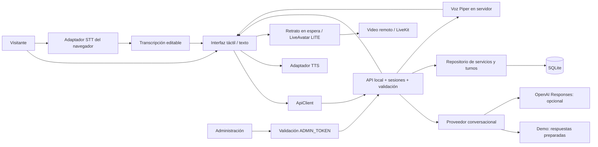

# 03 · Arquitectura técnica

> **Filtro escolar activo (v0.7.0).** Consultas frecuentes y desvíos se resuelven localmente; orientación pertinente puede usar OpenAI con cupos de 6 solicitudes por atención y 100 al día. [Reglas, límites y alcance](19-filtro-y-consumo.md).


> **Perfil activo: MetodoMogollon (16/09/2026).** Escuela de conducción; trato de usted; atención de lunes a viernes, 08:00–18:00 (Nueva York). Servicios confirmados por el responsable; precios y requisitos pendientes. Google Calendar será la agenda, aún sin conectar. El perfil de la escuela deshabilita las reservas locales y los horarios/precios de ejemplo descritos en la demo original. [Configuración y pendientes](16-metodomogollon.md).


## Decisión de arranque

Un **monolito modular local** sirve la interfaz y la API en un mismo origen. JavaScript nativo en el navegador; Node.js 24 en el servidor; SQLite para catálogo, reservas y auditoría. El servidor y la demo por texto no requieren paquetes adicionales ni infraestructura remota. La opción de video incluye una copia local del SDK LiveKit y requiere conexión al proveedor.

Esta estructura reduce el costo de instalación en la primera PC. Los límites entre interfaz, servicios conversacionales y repositorio permiten migrar módulos cuando exista una necesidad concreta. SQLite síncrono y las sesiones en memoria están pensados para una demo de una estación, no para escalar horizontalmente.

## Mapa de componentes



## Responsabilidades y límites

| Módulo | Responsabilidad | No debe hacer |
|---|---|---|
| `public/app.js` | Estado de pantalla, diálogo, voz, sesión y reserva | Decidir el precio efectivo o guardar secretos |
| `public/api.js` | Peticiones HTTP, token efímero y timeout | Persistir tokens en almacenamiento local |
| `providers/avatar.js` | Traducir estado a indicadores visuales; cargar retrato o respaldo SVG | Gestionar transacciones |
| `providers/speech.js` | Capturar/transcribir y sintetizar voz | Grabar audio o reservar servicios |
| `server/app.js` | Rutas, límites, sesiones, validación y autorización | Confiar en historial o precios enviados por clientes |
| `server/providers/ai.js` | Responder usando catálogo e historial acotado | Ejecutar herramientas de venta o recibir formulario de registro |
| `server/db.js` | Consultas parametrizadas, transacciones y reglas de reserva | Llamar servicios de IA |
| `public/admin.*` | Gestión local con credencial en memoria | Exponer acceso administrativo al visitante |

## Contratos de proveedores

```javascript
// Servidor. El signal permite cancelar al cerrar la sesión.
AiProvider.reply({ messages, services, signal })
// -> Promise<{ text: string }>

// Navegador. start se llama después de un gesto y aviso de voz.
SttProvider.available
SttProvider.start({ onPartial, onFinal, onError, onEnd })
SttProvider.stop()

TtsProvider.available
TtsProvider.speak(text, { onStart, onEnd, onError })
TtsProvider.stop()

AvatarProvider.setState('idle' | 'listening' | 'thinking' | 'speaking')
```

**Cambiar IA:** implementar una clase con `reply`, registrarla en `createAiProvider` y validar su configuración. Los detalles del proveedor permanecen en el servidor.

**Cambiar STT/TTS:** crear otro adaptador y sustituir su instancia al comienzo de `public/app.js`. Un proveedor con credenciales debe invocarse mediante una ruta del backend o credenciales efímeras de alcance limitado, nunca mediante una clave permanente en el navegador.

**Cambiar avatar:** implementar `setState` para un motor 3D, un video o un servicio de avatar. Mantener cancelación, silencio y estado consistente. El adaptador actual `PortraitAvatarProvider` muestra una recepcionista de apariencia fotográfica y conserva los indicadores externos. No anima labios ni expresiones. El SVG queda como respaldo de carga; los fonemas o visemas requieren extender el contrato de audio.

## Avatar de video: etapa 1 LiveAvatar LITE

`LiveAvatarService` administra credenciales, una sesión por proceso y cierre remoto. `LiveAvatarProvider` ofrece `start`, `speak`, `stopSpeech`, `resumeAudio` y `stop`; reproduce video/audio por LiveKit. `LiteAvatarTransport` espera el estado conectado y envía PCM16 mono a 24 kHz por WebSocket mediante `agent.speak` y `agent.speak_end`. `avatar-audio.js` convierte el WAV de Piper sin reproducir una segunda voz.

El texto sigue viniendo de Nexo (demo u OpenAI). El iPad recibe el WAV del servidor y lo transmite al control del avatar. El adaptador no publica micrófono ni cámara en LiveKit. FULL se conserva por compatibilidad y utiliza `avatar.speak_text`.

Retrato en espera; LiveAvatar al iniciar con configuración válida. Tope predeterminado de 60 segundos y cierre tras 45 segundos de inactividad durante video. Credenciales permanentes solo en servidor; token de sala y URL de control efímeros en navegador. El servidor bloquea nuevas sesiones si no se confirmó el cierre anterior.

El backend actual sigue en la PC Windows. Para iPad se necesita un proxy HTTPS y `PUBLIC_ORIGIN` exacto; no se ha desplegado ese acceso. La fase 2 añadirá un adaptador MetaHuman con renderizado externo al iPad. [Decisión y diagrama vigente](14-etapas-liveavatar-metahuman.md).

## Conversación

1. Aceptación del aviso → servidor crea token aleatorio de 256 bits.
2. El token solo vive en memoria del navegador; identifica una sesión efímera en el servidor.
3. El servidor añade el mensaje del visitante a su propio historial. Ignora cualquier historial adicional enviado por el cliente.
4. Se permite una respuesta en curso por sesión; se envían hasta 12 mensajes al adaptador.
5. El proveedor devuelve texto, sin herramientas con efectos sobre el centro.
6. Interfaz añade respuesta y llama TTS; el avatar reacciona a inicio/final del audio.
7. Finalización aborta tareas, cancela voz, limpia formularios y revoca token. El servidor elimina sesiones vencidas en un barrido cada 30 segundos.

El adaptador OpenAI utiliza HTTP con `fetch`, no un SDK. Envía `model`, `instructions`, `input`, `max_output_tokens` y `store: false`. Extrae contenido `output_text` de mensajes de asistente. Los errores no muestran respuestas crudas del proveedor. [Referencia oficial consultada](https://developers.openai.com/api/reference/typescript/resources/beta/subresources/responses/methods/create).

## API v0.4

| Método y ruta | Autorización | Solicitud / resultado |
|---|---|---|
| GET `/api/health` | Pública local | Estado del proceso y modo; no verifica conectividad con IA |
| GET `/api/avatar/config` | Pública local | Requisitos de video presentes, sin secretos |
| POST `/api/avatar/session` | Bearer de sesión | Modo y consentimiento → conexión temporal; consumo habilitado en servidor |
| DELETE `/api/avatar/session` | Bearer de sesión | Solicita cierre de su video remoto |
| GET `/api/config` | Pública local | Modo, TTL, retención y zona horaria; sin secretos |
| GET `/api/services` | Pública local | Servicios activos |
| GET `/api/services/:id/slots` | Pública local | Horarios libres en ISO UTC |
| POST `/api/sessions` | Consentimiento | `{consent:true}` → `{token}` |
| POST `/api/session/touch` | Bearer de sesión | Renueva inactividad si la sesión no venció |
| DELETE `/api/session` | Bearer de sesión | Aborta conversación y revoca token |
| POST `/api/chat` | Bearer de sesión | `{message}` → `{text,provider}` |
| POST `/api/appointments` | Bearer de sesión | Datos validados → comprobante sin PII |
| GET `/api/admin/overview` | Bearer administrativo | Catálogo completo y hasta 200 reservas |
| PATCH `/api/admin/services/:id` | Bearer administrativo | `{active:boolean}` |
| PATCH `/api/admin/appointments/:id` | Bearer administrativo | `{status:"cancelled"}` |

Reserva:

```json
{
  "requestId": "UUID generado por el cliente para este intento lógico",
  "serviceId": "orientacion",
  "slot": "un ISO UTC devuelto por /slots",
  "customerName": "Persona Demo",
  "email": "demo@example.test",
  "consent": true,
  "expectedPriceCents": 0
}
```

Errores en JSON `{error: "mensaje"}`: 400 entrada inválida; 401 token inválido/vencido; 403 origen/host ajeno; 404 recurso ausente; 409 conflicto; 413 cuerpo >16 KiB; 415 tipo de contenido inválido; 429 límite; 502 respuesta IA inválida; 503 proveedor o administración no disponibles.

Límites por dirección local y minuto: 180 solicitudes API totales, 20 sesiones nuevas, 20 mensajes, 10 reservas y 15 solicitudes administrativas y 3 inicios de avatar. Son límites de demo, no cuotas comerciales ni protección distribuida.

## Seguridad y tratamiento de datos

- Escucha loopback; valida Host/Origin locales o el origen HTTPS exacto configurado en PUBLIC_ORIGIN; sin CORS abierto.
- CSP con scripts del mismo origen, bloqueo de marcos, objetos y formularios ajenos; `nosniff` y caché desactivada.
- Datos dinámicos insertados con `textContent`; SVG de iconos tomado de una lista fija.
- Consultas parametrizadas, clave única de ocupación y transacciones para reserva/auditoría.
- Clave de IA exclusivamente en servidor; `.env` y bases de datos excluidos de Git.
- Credencial administrativa comparada mediante hash de longitud fija y comparación constante.
- No se guardan grabaciones. El historial no se escribe en SQLite. El formulario no se incorpora al prompt.
- El usuario podría escribir información personal en una consulta; se avisa que no lo haga, pero no existe un filtro automático de datos sensibles.
- El navegador o los proveedores externos pueden procesar voz/texto. La aplicación no puede garantizar su retención ni disponibilidad.
- El prompt limita las respuestas a catálogo, pero no garantiza ausencia de alucinaciones. La barrera de seguridad para transacciones es que el agente no tiene acceso a operaciones de reserva o cobro.
- SQLite no está cifrado. Una persona con acceso al disco o al usuario de Windows puede leerlo. El endurecimiento del sistema y el cifrado de dispositivo corresponden a la fase de despliegue.

## Evolución a kiosco y ventas

Primero fijar catálogo, recursos y agenda. Después incorporar identidades administrativas, dispositivo registrado y calendario compartido. Extraer el repositorio hacia PostgreSQL cuando se necesite concurrencia multiestación y mover sesiones a un almacén compartido.

Para pagos, añadir servicios separados `OrderService` y `PaymentProvider`. La orden mantiene precios y consentimiento confirmados; el proveedor alojado captura los medios de pago. Un webhook autenticado e idempotente cambia el estado a pagado. Una respuesta de IA o un retorno del navegador jamás debe considerarse prueba de pago.

El kiosco físico se trata como un dispositivo supervisado: arranque automático, modo kiosco del navegador, usuario restringido, watchdog y actualizaciones controladas. El hardware no debe filtrarse a los contratos de negocio.

## Fuentes técnicas

- [SQLite en Node.js](https://nodejs.org/api/sqlite.html): `DatabaseSync` y consultas preparadas. La implementación se verificó en Node 24.18.0.
- [SpeechRecognition](https://developer.mozilla.org/en-US/docs/Web/API/SpeechRecognition): compatibilidad y posible procesamiento remoto.
- [SpeechSynthesis](https://developer.mozilla.org/en-US/docs/Web/API/SpeechSynthesis): síntesis del navegador.


## Actualización v0.3.0

El recorrido predeterminado utiliza `LocalAvatarProvider` (Three.js/GLB) y `LocalSpeechProvider` (Web Audio). POST `/api/tts` requiere sesión y genera WAV con Piper local, sin shell ni almacenamiento de audio. GET `/api/config` informa `localVoice.available`. Los detalles del protocolo y sus límites están en [avatar local](12-avatar-local.md). La síntesis del navegador descrita anteriormente queda como adaptador disponible en código.

## Interpretación semántica v0.10.0

POST /api/chat agrega una ruta opcional de interpretación estructurada entre el filtro local y la respuesta al visitante. school-intent.js define el contrato, validación y resolución; OpenAiProvider.interpret implementa Responses. La salida no contiene texto libre para el visitante, solo intenciones e IDs activos. El servidor consulta el catálogo. Usa el mismo presupuesto, cancelación y sesión que la orientación. [Detalle](22-interpretacion-intencion.md).
