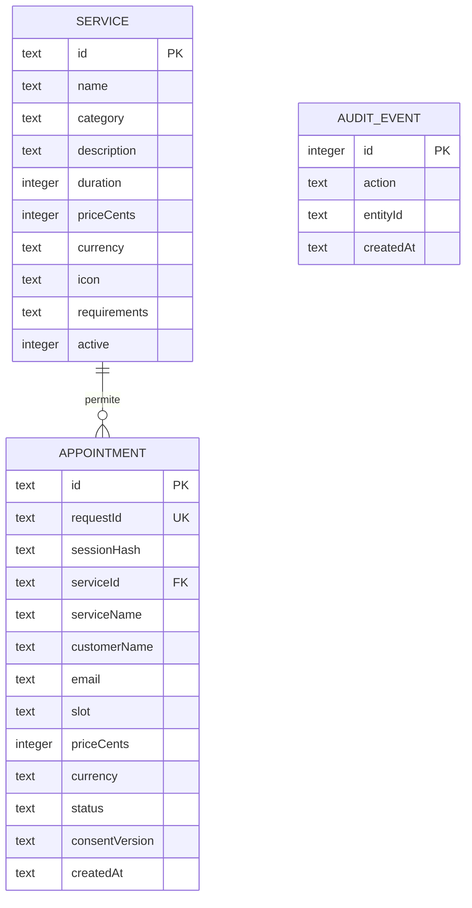
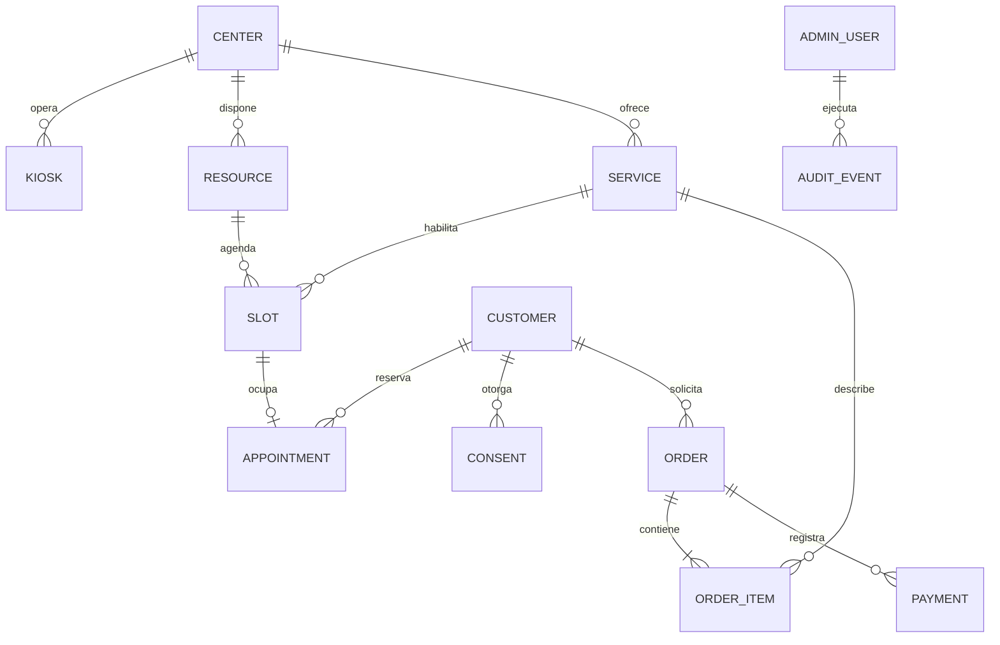

# 04 · Modelo de datos

> **Perfil activo: MetodoMogollon (16/09/2026).** Escuela de conducción; trato de usted; atención de lunes a viernes, 08:00–18:00 (Nueva York). Servicios confirmados por el responsable; precios y requisitos pendientes. Google Calendar será la agenda, aún sin conectar. El perfil de la escuela deshabilita las reservas locales y los horarios/precios de ejemplo descritos en la demo original. [Configuración y pendientes](16-metodomogollon.md).


## Modelo implementado

La etapa LiveAvatar no cambia las tablas de catálogo o turnos. La sesión de video (propietario, identificador externo, vencimiento y cierre pendiente) permanece en memoria del servidor; las credenciales permanentes viven en `.env`. No se persisten audio, video ni tokens del proveedor en SQLite. La etapa MetaHuman reutilizará las entidades comerciales existentes. [Plan de etapas](14-etapas-liveavatar-metahuman.md).



La tabla de auditoría referencia identificadores de forma lógica, sin FK, para poder describir cambios de distintas entidades. No incluye mensajes, nombres ni correos.

### `services`

| Campo | Semántica |
|---|---|
| `id` | Identificador estable; ejemplo `orientacion` |
| `name`, `category`, `description` | Contenido de catálogo |
| `duration` | Duración informativa en minutos; no determina recursos del calendario |
| `priceCents`, `currency` | Importe entero en unidad menor y código de moneda; ambos de ejemplo |
| `icon` | Identificador de icono de una lista fija del frontend |
| `requirements` | Requisitos visibles y utilizables por el agente |
| `active` | 0/1; solo 1 aparece en catálogo público y permite nuevas reservas |

El catálogo se crea con `INSERT OR IGNORE`. No hay un editor completo ni migrador de esquema en v0.1; modificar la semilla no actualiza registros existentes. No borrar datos existentes como mecanismo normal de actualización.

### `appointments`

| Campo | Semántica y validación |
|---|---|
| `id` | UUID del servidor; la interfaz muestra sus primeros 8 caracteres como referencia visual |
| `requestId` | UUID del cliente, único globalmente para evitar duplicar un mismo intento |
| `sessionHash` | SHA-256 del token de sesión; limita reutilización de requestId a su sesión |
| `serviceId` | FK a catálogo |
| `serviceName` | Copia del nombre al reservar, para preservar el comprobante si cambia el catálogo |
| `customerName` | Entre 2 y 80 caracteres |
| `email` | Hasta 120 caracteres, normalizado a minúsculas; formato validado, propiedad no verificada |
| `slot` | Fecha/hora ISO UTC, tomada exclusivamente de horarios generados disponibles |
| `priceCents`, `currency` | Copia del importe del servidor en la confirmación |
| `status` | `reserved` o `cancelled`; no existe estado pagado |
| `consentVersion` | `2026-09-v1`, versión del aviso de esta demo |
| `createdAt` | ISO UTC de creación; el consentimiento se registra en esa misma operación |

El código corto es una referencia de comodidad, no una credencial ni una garantía de unicidad global. La API y la administración operan sobre el UUID completo. Antes de integraciones externas se debe definir un número de turno único apto para el volumen esperado.

### `audit_events`

Acciones actuales: `appointment.reserved`, `appointment.cancelled`, `service.enabled`, `service.disabled`. Se escriben en la misma transacción de la operación. No existe identidad nominal del administrador porque la demo utiliza un token compartido; una auditoría de producción debe añadir actor, dispositivo y correlación.

## Sesiones y mensajes efímeros

Estos datos viven en un `Map` del proceso, no en SQLite:

```text
Session[token aleatorio de 256 bits]
  messages: hasta 12 mensajes de rol user/assistant
  expiresAt: expiración por inactividad
  busy: exclusión de solicitudes de chat simultáneas
  controller: cancelación de petición IA activa
```

El historial se pierde al detener el servidor. Una sesión vencida se rechaza inmediatamente en la API y se elimina en el próximo barrido de 30 segundos. La pantalla se limpia al finalizar o a los cinco minutos sin interacción. El formulario pendiente solo existe en memoria del navegador.

## Reglas de consistencia

- Índice parcial único `(serviceId, slot) WHERE status='reserved'`.
- `BEGIN IMMEDIATE` agrupa alta y auditoría; una falla hace rollback.
- Repetir requestId con iguales datos y sesión devuelve el mismo registro reservado.
- Repetirlo con contenido o sesión diferente devuelve 409. Si el turno fue cancelado, se requiere un nuevo intento.
- Cancelar cambia el estado y libera el índice parcial de ocupación.
- El servidor rechaza servicio inactivo, horario no ofertado y precio esperado distinto al vigente.
- No existe persistencia de número de tarjeta, documento, audio, respuesta del modelo ni prompt.

## Tiempo y retención

La generación de horarios usa la zona horaria de la PC del servidor; se transportan como UTC y se muestran con esa zona informada por `/api/config`. No hay fecha fija codificada: se generan cinco días hábiles después del día actual.

`purge(7)` borra reservas cuando tanto `slot` como `createdAt` quedan antes de la fecha actual menos 7 días; esto preserva citas futuras. El arranque y la limpieza horaria ejecutan esa política. También se eliminan eventos de auditoría anteriores a 7 días. El servidor apagado no ejecuta limpieza. Los respaldos deben contar con su propia política, aún pendiente.

SQLite usa claves foráneas, modo WAL y `secure_delete`. No equivale a cifrado, borrado certificado ni eliminación de copias de seguridad. La retención definitiva debe definirla el centro antes de usar datos reales.

## Modelo objetivo para fases futuras



Entidades futuras:

- **Center/Kiosk:** sede, zona horaria, dispositivo, estado y configuración.
- **Resource/Slot:** profesional o ventanilla, capacidad, feriados, bloqueos, duración y concurrencia real.
- **Customer:** identidad mínima; separación de perfiles y turnos, con política de consentimiento.
- **Consent:** propósito, versión, momento y revocación cuando corresponda.
- **Order/OrderItem:** adquisición comercial separada de la cita, con importes congelados y estados propios.
- **Payment:** proveedor, referencia externa, monto, moneda, estado e idempotencia; nunca credenciales de tarjeta.
- **AdminUser/AuditEvent:** identidad individual, roles y registro de operaciones.

Para pasar a PostgreSQL: añadir migraciones versionadas, interfaz de repositorio, pruebas de integridad y migración controlada; no copiar indiscriminadamente datos personales de la demo a producción.

## Configuración editable del centro (v0.5.0)

center_settings: id (1), revision (entero), document (JSON con profile y services), updatedAt (ISO). Actualización transaccional y control de revisión. Precio y duración admiten null dentro del documento; precio cero significa gratuito. Los servicios originales y reservas anteriores se conservan. Ver [Administración](17-administracion.md).

## Uso diario de IA (v0.7.0)

ai_daily_usage: day (clave primaria, fecha en Nueva York), calls (solicitudes reservadas), inputTokens y outputTokens (uso conocido). Sin texto de visitantes ni identificadores de sesión. Reserva atómica antes de consultar OpenAI y conservación entre reinicios; no se elimina con la purga de turnos.

## Registro administrativo vigente desde v0.14.0

Además del contexto temporal, SQLite conserva `conversations` (identificador aleatorio, fechas, canal y estado) y `conversation_turns` (pregunta, respuesta generada, resultado, origen, servicio, latencia y uso de IA reportado). La relación permite eliminar los mensajes junto con su conversación al aplicar una retención configurada. No se guarda el token del visitante. Consulte el [modelo y alcance actual](32-historial-conversaciones.md).


## Biblioteca de audio — v0.24.0

NEXO-42: audio generado reutilizable para respuestas aprobadas, con metadatos SQLite y archivos WAV privados. Administración permite consultar el uso y vaciar audios; presupuesto inicial de 128 MB y caducidad de 30 días. [Alcance, arquitectura, privacidad y pruebas](40-biblioteca-audio.md). La voz actual sigue siendo local; no supone ahorro por sesión de LiveAvatar.
