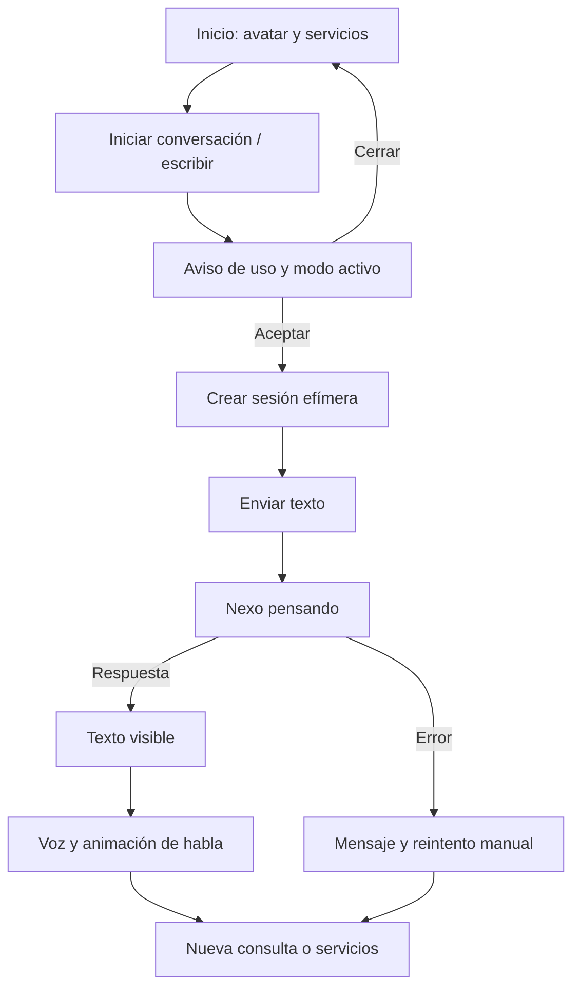
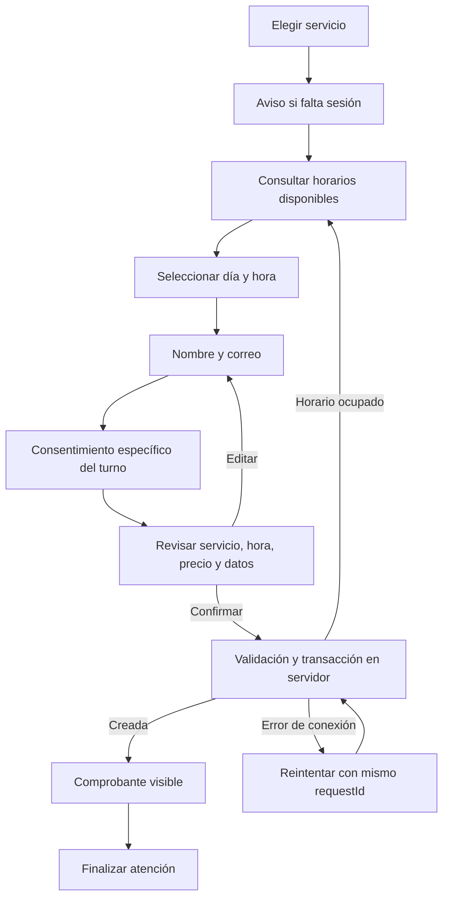

# 05 · Flujos de usuario

> **Perfil activo: MetodoMogollon (16/09/2026).** Escuela de conducción; trato de usted; atención de lunes a viernes, 08:00–18:00 (Nueva York). Servicios confirmados por el responsable; precios y requisitos pendientes. Google Calendar será la agenda, aún sin conectar. El perfil de la escuela deshabilita las reservas locales y los horarios/precios de ejemplo descritos en la demo original. [Configuración y pendientes](16-metodomogollon.md).

## Etapa 1: atención con LiveAvatar

En espera se muestra un retrato y el catálogo, sin sesión remota. «Iniciar conversación» crea la sesión local tras consentimiento y conecta LiveAvatar si está configurado y habilitado. Cada respuesta se muestra como texto, se sintetiza en el servidor y se transmite a LITE para animar el video. Sin cuenta configurada continúa la demo textual explícita; un fallo de conexión muestra error y permite continuar por texto.

Finalizar, salir de la pantalla o acumular 45 segundos sin actividad durante video limpia la atención y solicita cierre remoto. El tope de 60 segundos cierra el video, limpia la conversación y devuelve al inicio; una nueva conexión requiere una acción explícita. Habla, generación y escucha activa suspenden el conteo de inactividad. [Detalles y límites](14-etapas-liveavatar-metahuman.md).

## A. Primera conversación

La voz nunca es el único canal. La respuesta permanece visible y tiene un botón para escuchar de nuevo. Si el proveedor de IA falla, el visitante puede continuar con los servicios y el formulario sin depender del agente.

## B. Entrada por voz

1. Tocar el micrófono.
2. Si falta sesión, aceptar aviso de uso.
3. Aceptar aviso específico de voz; se explica el posible procesamiento por el proveedor del navegador.
4. Autorizar micrófono en el navegador.
5. Mostrar estado «Te escucho» y transcripción parcial/final.
6. Detener por final de reconocimiento o mediante botón.
7. Revisar o corregir el texto; **no se envía automáticamente**.
8. Pulsar enviar; recibir texto y voz.

Si se deniega permiso, no hay micrófono, no se reconoce voz o falta internet, se muestra una explicación y se conserva la escritura manual. Iniciar escucha cancela la voz de salida para reducir realimentación. No hay escucha continua, interrupción natural ni audio bidireccional simultáneo.

## C. Reserva y registro

El registro consiste en datos de contacto para esa reserva; no crea una cuenta de usuario. El comprobante confirma únicamente la reserva en la base local de demostración. No implica envío de email, cobro ni contratación.

Casos especiales:

- **Doble toque:** la interfaz desactiva Confirmar mientras espera y el servidor aplica idempotencia.
- **Respuesta de red perdida:** Reintentar conserva el identificador del intento; si se guardó, devuelve la misma reserva.
- **Horario ocupado:** se informa el conflicto y se pueden volver a consultar los horarios.
- **Precio cambiado:** el servidor lo rechaza; hay que cerrar y volver a abrir el servicio después de actualizar el catálogo.
- **Servicio pausado:** no admite nuevas reservas aunque la tarjeta estuviera abierta previamente.
- **Sesión finalizada durante confirmación:** no se vuelve a mostrar el resultado en otra sesión; puede haber una reserva ya confirmada en el servidor. El personal debe comprobarla antes de repetir. No se revierte una reserva confirmada por cerrar la pantalla.

## D. Finalización e inactividad

La persona puede tocar **Finalizar** en la cabecera o **Finalizar atención** en el comprobante. La pantalla borra conversación, borradores y formularios, detiene voz, cancela peticiones y vuelve a los servicios. Las reservas confirmadas permanecen según su política de retención.

A los cuatro minutos de inactividad aparece «¿Sigues aquí?». **Sí, continuar** renueva actividad; a los cinco minutos se termina la sesión. El backend aplica su propio vencimiento, independiente de la pantalla. Mantener actividad real provoca una renovación periódica; una pestaña abandonada no conserva indefinidamente la sesión.

## E. Administración

1. Personal autorizado abre `/admin` e ingresa el token configurado fuera del kiosco.
2. Ve servicios y hasta 200 reservas recientes.
3. Puede pausar/habilitar servicios sin borrar reservas existentes.
4. Para cancelar un turno, confirma la acción. El servidor cambia estado y libera horario.
5. Cierra sesión; la vista y la credencial se eliminan de memoria. También hay cierre local por inactividad.

La administración no aparece como enlace en la pantalla de atención. Una ruta oculta no es una barrera de seguridad: las operaciones se autorizan en el servidor. Para un centro real se requiere sustituir el token compartido por identidades individuales.

## F. Compra y pago futuros

Selección de servicio → condiciones comerciales → registro mínimo → resumen de orden → consentimiento y confirmación → checkout del proveedor → webhook verificado → comprobante. Si hay una reserva temporal de capacidad, debe tener vencimiento y liberación definidos.

El modelo conversacional puede explicar el proceso, pero no declara éxito del pago. El estado lo determina el backend al recibir una confirmación válida del proveedor. Cancelaciones y reembolsos serán operaciones distintas con permisos y auditoría.

## Vista de llamada v0.4.2

El inicio mantiene todas sus opciones. Al conectar se abre la vista de llamada a pantalla completa dentro de la aplicación; al colgar o vencer el minuto vuelve al inicio limpio. [Controles, encuadre y criterios](15-vista-llamada.md).
