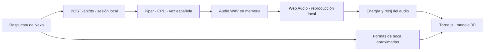

# 12 · Recepcionista 3D y voz local

> Experimento anterior, disponible con `AVATAR_PROVIDER=local3d`. Desde v0.4.0 no se carga por defecto. La estrategia vigente es [LiveAvatar primero y MetaHuman después](14-etapas-liveavatar-metahuman.md). El contenido siguiente describe esa versión histórica.

**v0.3.3 · Opción predeterminada, sin cuenta ni pago por minuto de avatar.**

## Cómo probar

En esta PC ya están instalados el modelo 3D, Piper y la voz española. Abre [Nexo](http://localhost:3000), espera a que aparezca el personaje y pulsa **Iniciar conversación**. Puedes escribir, escuchar las respuestas, silenciar y finalizar. **Ver imagen** alterna con el retrato anterior.

Para llevar el ZIP a otra PC Windows x64:

1. Extrae la carpeta y ten instalado Node.js 24 o superior.
2. Ejecuta [INSTALAR-VOZ-LOCAL.cmd](../INSTALAR-VOZ-LOCAL.cmd) una vez. Descarga el motor y la voz desde sus fuentes originales, comprueba SHA-256 y los instala solo dentro de `runtime/`. No necesita claves ni modifica las voces de Windows.
3. Abre [INICIAR.cmd](../INICIAR.cmd) y usa Chrome o Edge con WebGL habilitado.

La descarga inicial necesita internet. Después, el avatar y la voz de respuesta funcionan localmente. El micrófono sigue utilizando el reconocimiento del navegador y puede requerir internet. La conversación predeterminada continúa en modo DEMO, con respuestas preparadas; todavía no se incluyó un modelo generativo local.

## Qué mueve realmente

- Modelo 3D con geometría, esqueleto y formas faciales; no es una fotografía deformada.
- Rotaciones pequeñas de cabeza, respiración sutil, inclinación al escuchar y parpadeo.
- Sonrisa leve y movimientos de boca que siguen la energía del audio reproducido.
- Formas de labios aproximadas para vocales y consonantes españolas, calculadas desde el texto.
- Silencio, interrupción y fin de sesión cancelan la voz y cierran la boca.
- La preferencia de movimiento reducido detiene los movimientos decorativos; se conserva la boca asociada a la comunicación.

**Límite importante:** la temporización fonética se estima distribuyendo el texto sobre la duración del audio. No es una alineación exacta de cada fonema. Las pausas reales se detectan por la energía del sonido. Para mejorar la precisión será necesario un alineador fonético o un sintetizador que entregue tiempos por fonema.

El personaje tiene apariencia 3D y utiliza un modelo reutilizado. No reproduce la identidad fotográfica anterior. Se adaptaron color del uniforme, pose de brazos, cámara, iluminación y animación; la base geométrica no se creó desde cero.

## Arquitectura

| Módulo | Responsabilidad |
|---|---|
| `server/providers/local-tts.js` | Ejecutar Piper con texto por stdin, sin shell; generar WAV y cancelar el proceso |
| `public/providers/local-speech.js` | Reproducir WAV, observar energía y emitir formas de boca |
| `public/providers/avatar-3d.js` | Cargar GLB, representar rostro y animar esqueleto/formas faciales |
| `public/assets/recepcionista-3d.glb` | Modelo local con sus texturas incrustadas |
| `public/vendor/three/` | Three.js 0.180.0 y cargador GLTF, servidos desde la PC |

`LocalAvatarProvider` conserva `setState` y añade `load`, `setEnabled` y `setMouth({shape,level})`. `LocalSpeechProvider` conserva `available`, `speak` y `stop`. Cambiar la voz o el personaje no cambia las reservas.

La API requiere sesión, valida un máximo de 3000 caracteres y limita a 20 solicitudes por minuto. Se permite una síntesis a la vez; tiempo máximo 25 segundos y salida máxima 5 MB PCM. La respuesta WAV se mantiene en memoria y no se registra en disco. El cierre del cliente cancela la generación; la finalización local cancela tareas de ese visitante. Los ejecutables y el modelo de voz no se sirven por HTTP.

## Recursos, versiones y atribuciones

- **Modelo:** `mpfb.glb` del [proyecto TalkingHead](https://github.com/met4citizen/TalkingHead), creado con Blender/MPFB. Su README declara este recurso **CC0**. Se reutiliza el modelo, no el motor TalkingHead. [Declaración original](https://github.com/met4citizen/TalkingHead#attributions), [CC0](https://creativecommons.org/publicdomain/zero/1.0/). Descargado el 15 de septiembre de 2026. SHA-256: `63C645A2A863B9972E9A9C2ED576A1DE4C390B8475508E1473E69C87A3EE299C`.
- **Three.js 0.180.0:** [proyecto oficial](https://github.com/mrdoob/three.js), [licencia MIT incluida](THREE-LICENSE.txt). Se ajustaron únicamente las rutas de importación de GLTFLoader y BufferGeometryUtils para servir archivos locales sin CDN.
- **Piper Windows x64:** [distribución 2023.11.14-2](https://github.com/rhasspy/piper/releases/tag/2023.11.14-2). Es la distribución nativa anterior; el [desarrollo actual](https://github.com/OHF-Voice/piper1-gpl) continúa en otro repositorio. Esta entrega no la presenta como versión actual. El instalador descarga el paquete original; `runtime/` queda fuera de Git y del ZIP. Para redistribuir sus binarios en otro producto, deben acompañarse las licencias y obligaciones de sus componentes, incluido eSpeak NG.
- **Voz:** [Piper es_ES-sharvard-medium](https://huggingface.co/rhasspy/piper-voices/tree/main/es/es_ES/sharvard/medium), hablante `F=1`, 22050 Hz. [Ficha original incluida](SHARVARD-MODEL-CARD.txt). La ficha declara el conjunto de entrenamiento con licencia [CC BY 3.0](https://creativecommons.org/licenses/by/3.0/).
- **Atribución del corpus:** Vincent Aubanel, Maria Luisa Garcia Lecumberri y Martin Cooke (2014), *Sharvard_IJA*, LISTA Consortium. [Registro y datos originales](https://doi.org/10.7488/ds/75). La voz es sintetizada por el modelo Piper; no se afirma que esas personas avalen Nexo.

El instalador contiene las URLs y hashes exactos de los tres archivos de voz. Si un archivo remoto cambia, se rechaza hasta revisar y actualizar la versión. El proyecto no descarga recursos al abrir la pantalla del kiosco.

## Validación realizada

- 47 pruebas unitarias/API aprobadas, incluidas cancelación de Piper, aislamiento, límites, WAV y temporización de formas.
- 10 recorridos de interfaz en Edge; STT y audio de esos recorridos usan dobles explícitos.
- Prueba adicional **real**, con modelo GLB y Piper instalado: reproducción de WAV, energía de audio no nula, boca animada, cambios de pose en espera, silencio, repetición, fin de sesión y alternancia con imagen. La página bloqueó peticiones externas y no intentó ninguna.
- Una frase de prueba de 3,63 segundos se generó en aproximadamente 1,69 segundos en esta PC. Es una medición puntual, no un compromiso de latencia.
- Inspección visual de las capturas. No se evaluó el sonido mediante escucha humana ni se comprobó el micrófono físico.

Prueba adicional reproducible: `node tests/local-avatar.e2e.js`, con Playwright instalado y `BROWSER_CHANNEL=msedge` si se usa Edge. Requiere el runtime local; falla explícitamente si falta. [Captura durante habla local](capturas/avatar-local-hablando.png).

## Próximas mejoras

1. Escuchar la voz en el altavoz definitivo y ajustar velocidad, pronunciación y volumen.
2. Refinar rostro, peinado y uniforme del modelo, o sustituirlo por un personaje propio compatible.
3. Incorporar alineación fonética para mejorar coincidencia de labios.
4. Evaluar STT y un modelo conversacional locales si se requiere todo el recorrido sin internet.

LiveAvatar permanece como opción externa separada. No se inicia ni consume créditos al usar el avatar local.

## Ajuste v0.3.1 · Ejecutiva de ventas

Se añadieron pelo largo castaño y solapas con blusa clara mediante geometría propia en `executive-style.js`. Los accesorios siguen al esqueleto del modelo base; no añaden descargas ni servicios. La expresión de reposo es neutral, con sonrisa mínima y cejas relajadas.

La animación de labios combina las formas vecinas en ventanas de 65 ms, usa una medición de audio más estable (1024 muestras), suaviza el nivel con ataque de 70 ms y salida de 120 ms, limita la apertura y reduce la velocidad de transición de las formas faciales. Así se atenúan los saltos causados por picos de volumen y cambios de letra. Continúa siendo una aproximación fonética, no alineación exacta.

Se añadieron pruebas de continuidad entre formas, reducción de picos y retorno al reposo. El recorrido con Piper real comprueba de nuevo habla, silencio, repetición y cierre.

## Corrección v0.3.2 · Recuperar el modelo anterior

El usuario rechazó el aspecto añadido en v0.3.1. Se recuperó el modelo 3D anterior, con el peinado recogido original y prenda verde. Se conservaron la expresión relajada y las transiciones de labios suavizadas. El ensayo `executive-style.js` permanece como código sin utilizar; no se aplica al personaje.

Durante la carga se muestra «Cargando avatar 3D…» en lugar de mostrar primero el retrato fotográfico de otra identidad. El retrato sigue disponible mediante «Ver imagen» o como respaldo ante un error. La prueba de navegador retrasa deliberadamente la descarga del modelo para verificar que no aparezca otra persona durante esa espera.

## v0.3.3 · Asesora ejecutiva

La apariencia predeterminada ahora utiliza un traje y cabello largo modelados de MakeHuman Community, ajustados al cuerpo y esqueleto. Se mantienen la voz y los labios suavizados. [Diseño, comparación, recursos y atribuciones](13-asesora-ejecutiva.md). El ensayo de geometría de v0.3.1 continúa sin utilizarse.
