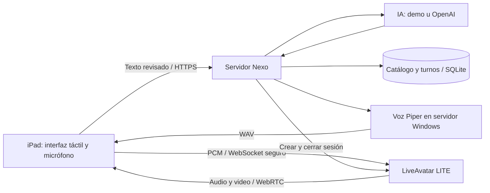

# 14 · Decisión: LiveAvatar en iPad, MetaHuman después

**Decisión acordada con el usuario · 16 de septiembre de 2026 · v0.4.0.**

El kiosco será una interfaz táctil en iPad. La primera etapa utiliza una asesora de LiveAvatar; la segunda evaluará un personaje propio con MetaHuman. Catálogo, turnos, conversación y datos pertenecen a Nexo y permanecen separados del motor del avatar.

## Etapa 1: LiveAvatar LITE

Elegimos **LITE** para enviar nuestra voz sintetizada a LiveAvatar y recibir video sincronizado. Nexo conserva la elección del proveedor de IA, reconocimiento de voz y síntesis. La sala de LiveKit puede ser creada por LiveAvatar; este piloto no requiere una cuenta LiveKit independiente. [Configuración oficial](https://docs.liveavatar.com/docs/lite-mode/configuration).



**El iPad no ejecuta Node, Piper ni un personaje de Unreal.** Presenta la interfaz, captura la voz mediante el adaptador disponible y reproduce el video. Para el primer piloto, la PC Windows existente puede alojar Nexo y Piper. Debe permanecer encendida y accesible mediante HTTPS. Más adelante se podrá trasladar el backend a un servidor; el instalador Piper actual es para Windows y requiere adaptación si cambia el sistema operativo.

### Implementado en esta entrega

- Retrato de espera, sin abrir una sesión remota ni descargar el modelo 3D anterior.
- «Iniciar conversación» solicita consentimiento y conecta la asesora cuando las credenciales, voz y habilitación de consumo están configuradas. Sin configuración, permite probar texto y voz local con el modo DEMO visible.
- Nexo obtiene la respuesta del agente y genera voz. El adaptador convierte el WAV a PCM16 mono de 24 kHz, lo envía en bloques y confirma el fin de la intervención. Espera tanto audio/video como el estado conectado del canal de control.
- Interrupción de la voz, descarte de respuestas tardías y correlación de los eventos de habla con cada intervención.
- Una sesión remota simultánea por proceso. Tope predeterminado de **60 segundos**; cierre de atención después de **45 segundos sin actividad** mientras el video está conectado. El tiempo de generación, habla o escucha activa no cuenta como inactividad.
- Finalizar, salir de la pantalla o cerrar la página solicita cierre remoto y limpia la atención. El proveedor y el servidor reciben también el límite de duración. Si falla el cierre, se reintenta y se bloquea otro inicio hasta confirmarlo.
- La autorización de uso de créditos es una configuración del responsable en el servidor. El visitante no puede habilitarla desde el navegador.
- Alternativa textual y retrato ante fallo. No hay reconexión automática que abra nuevas sesiones con consumo.

La conversación todavía funciona por turnos: hablar, revisar la transcripción y enviar. No se ha implementado conversación simultánea con interrupción automática al detectar voz. La síntesis espera un WAV completo antes de enviarlo; mediremos la latencia real antes de optimizar con audio incremental.

### Credenciales: qué hace falta y cuándo

| Momento | Requisito |
|---|---|
| Desarrollo, pruebas y demo preparada | Ninguna clave externa |
| Ver a la asesora en video real | Cuenta/API de LiveAvatar, avatar ID, acceso y créditos necesarios para ese avatar |
| Probar video con respuestas preparadas | LiveAvatar; OpenAI todavía no es necesario |
| Conversación generativa real | API key de OpenAI y modelo habilitado en la cuenta |
| Voz de respuesta actual | Piper instalado en el servidor; sin clave de OpenAI para sintetizar |

Las claves se guardan en **`.env` del servidor**. No se envían al chat, al repositorio ni al iPad. El navegador recibe únicamente credenciales efímeras de reproducción/control. La suscripción o habilitación de cuenta se valida en una conexión real, no por la mera presencia de variables.

1. Elegir en LiveAvatar una mujer adulta con aspecto de asesora ejecutiva y revisar una muestra: rostro, cabello, vestuario, mirada y pronunciación en español. La apariencia real depende del avatar seleccionado; el retrato de espera no garantiza la misma identidad.
2. Ejecutar [CONFIGURAR-AVATAR.cmd](../CONFIGURAR-AVATAR.cmd). Introducir la clave y el avatar ID localmente. Habilitar créditos cuando se vaya a realizar la prueba.
3. Si falta la voz, ejecutar [INSTALAR-VOZ-LOCAL.cmd](../INSTALAR-VOZ-LOCAL.cmd).
4. Reiniciar Nexo, pulsar «Iniciar conversación» y verificar una atención breve. «Probar video» permite un diagnóstico manual y sandbox Wayne, que es un avatar técnico distinto de la asesora.
5. Para IA real, configurar las tres variables de OpenAI del [README](../README.md) y reiniciar. Comprobar que la interfaz indique «IA · OpenAI».

Configuración de ejemplo, sin credenciales reales:

```dotenv
AVATAR_PROVIDER=liveavatar
LIVEAVATAR_MODE=LITE
LIVEAVATAR_API_KEY=
LIVEAVATAR_AVATAR_ID=
LIVEAVATAR_ALLOW_PAID=false
LIVEAVATAR_MAX_SECONDS=60
AI_PROVIDER=demo
OPENAI_API_KEY=
OPENAI_MODEL=
PUBLIC_ORIGIN=
```

`LIVEAVATAR_ALLOW_PAID=true` habilita la asesora configurada. La duración admite 30–60 segundos, sujeta además a los límites de la cuenta. Sandbox pide 60 segundos. LITE no requiere `LIVEAVATAR_VOICE_ID`; FULL se conserva como compatibilidad y sí lo requiere. No se consumen sesiones por dejar abierta la pantalla de espera. Los límites son por sesión, **no un presupuesto mensual**; cuotas comerciales y medición agregada quedan pendientes.

### Preparar el iPad: siguiente validación

1. Confirmar modelo, versión de iPadOS, soporte físico, alimentación, Wi‑Fi y distancia del visitante.
2. Publicar el backend mediante un proxy HTTPS con certificado válido. El proceso sigue escuchando en `127.0.0.1`; `PUBLIC_ORIGIN=https://nombre-del-kiosco` permite ese origen exacto, sin barra final. Esta variable **no instala el proxy ni publica la aplicación**. No basta con abrir `localhost` desde el iPad: allí se refiere al propio iPad.
3. Restringir la red y el acceso del piloto; no exponer la administración como un servicio público sin la autenticación y operación previstas para producción.
4. Abrir Safari y probar reproducción tras tocar Iniciar. Si el navegador bloquea audio, usar «Activar sonido». Validar micrófono; si el STT del navegador no es suficiente, sustituirlo por un adaptador de servidor. Texto y catálogo deben seguir disponibles.
5. Usar Acceso guiado durante el piloto supervisado. Evaluar modo de una sola app y gestión de dispositivos para operación continua.
6. Ensayar corte de Wi‑Fi, permisos denegados, cierre/recarga, rotación, abandono, ruido ambiental, interrupción y reserva. Confirmar que otra persona no vea datos de la anterior.

**Criterio de salida:** diez atenciones supervisadas en el iPad objetivo, con audio comprensible, sincronización aceptada por el usuario, turnos correctos, cierre remoto comprobado y tiempos/consumo medidos. La prueba debe registrar fallos, no solo casos exitosos. La elección final del avatar y de la voz se aprueba viendo y escuchando una conexión real.

## Etapa 2: MetaHuman

Es una evolución planificada, **no implementada**. Se creará una asesora propia en Unreal/MetaHuman, con animación facial alimentada por audio y video enviado al iPad mediante una solución de streaming. El renderizado se prevé en una PC con GPU del centro o en un servidor GPU; la elección dependerá de concurrencia, latencia, red, mantenimiento y costo medidos en la etapa 1.

Se añadirá un adaptador con las mismas operaciones de sesión, habla, interrupción y cierre que LiveAvatar. Puede requerir extender el transporte de audio; no debe cambiar la API de catálogo, reservas o administración. No se promete una sustitución instantánea: hay que construir y validar la creación del personaje, la animación y el servicio de renderizado.

Para iniciarla: piloto LiveAvatar estable, volumen real de atenciones, presupuesto de infraestructura y diseño visual aprobado. Comparar el costo total de LiveAvatar con GPU, desarrollo, licencias aplicables y operación propia. La fecha y el hardware se definen entonces.

## Estado de validación y fuentes

La integración y su ciclo de vida se verifican con pruebas locales y dobles de LiveAvatar. **Actualización v0.4.1:** sesión externa verificada en Edge con video real 1280 × 720 y audio activo. Se confirmó el cierre remoto. Quedan pendientes valoración física de voz/labios, OpenAI real e iPad físico. El estado detallado está en [validación](08-validacion.md).

Referencias consultadas para la implementación: [ciclo de vida LITE](https://docs.liveavatar.com/docs/lite-mode/lifecycle), [eventos y formato de audio](https://docs.liveavatar.com/docs/lite-mode/events), [crear token](https://docs.liveavatar.com/api-reference/sessions/create-session-token), [iniciar sesión](https://docs.liveavatar.com/api-reference/sessions/start-session). El código restringe conexiones a dominios LiveAvatar/LiveKit autorizados y el host exacto `webrtc-signaling.heygen.io` devuelto por la API autenticada; un endpoint diferente exige verificar su legitimidad antes de ampliar la lista.
