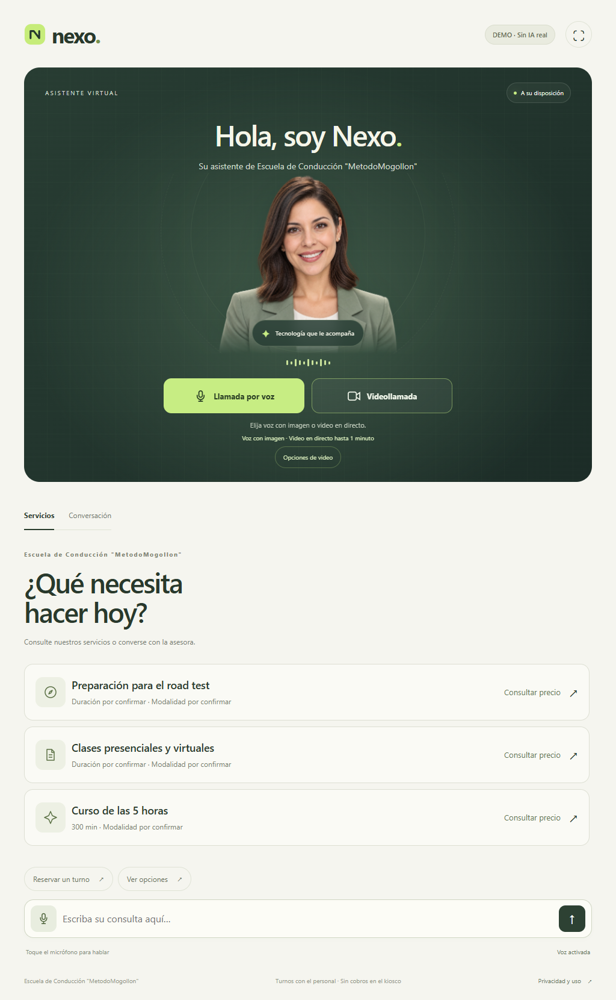
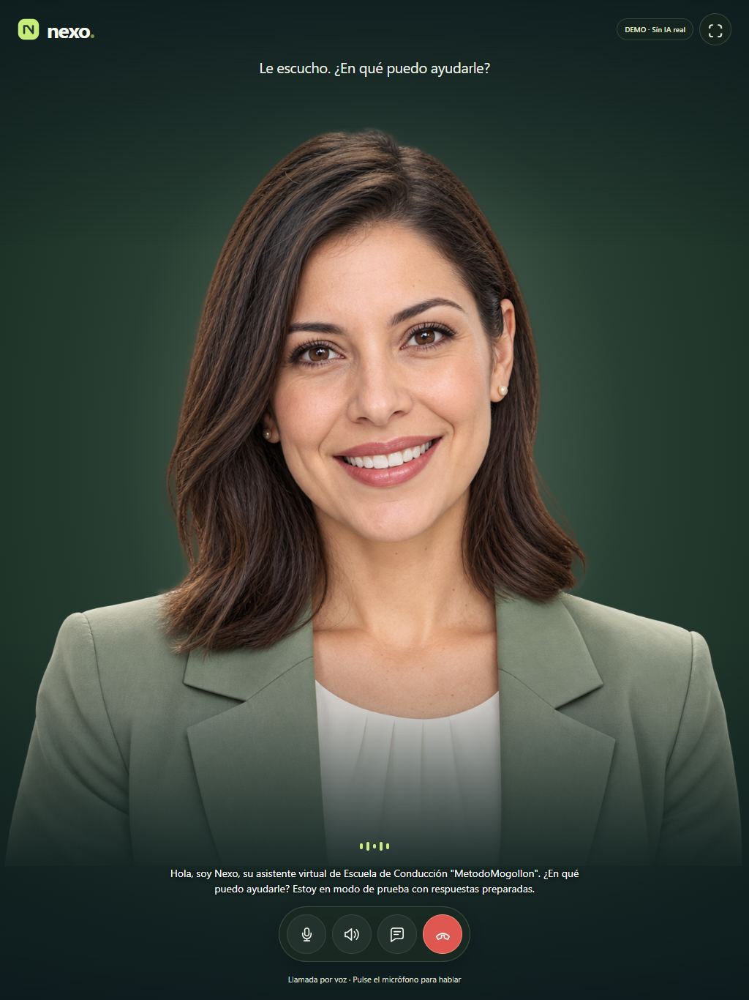

# Elección de llamada por voz o video

Versión 0.6.0 · 17 de septiembre de 2026

## Inicio del kiosco

Dos botones explícitos: Llamada por voz y Videollamada. El primero usa el retrato existente de la recepcionista, como en la referencia del responsable. El segundo inicia el video de LiveAvatar. Las fichas de servicios y el chat por texto siguen disponibles. Opciones de video conserva la configuración y diagnóstico manual.

## Llamada por voz

- Vista inmersiva con retrato, indicador de actividad y controles de micrófono, sonido, conversación escrita y colgar.
- Reconocimiento de voz del navegador, transcripción editable y envío manual. El micrófono se activa desde el botón, con su aviso de uso; no se añadió escucha permanente ni envío automático.
- Nexo utiliza el mismo catálogo y proveedor de IA. La respuesta se sintetiza con Piper en la PC y se reproduce directamente en el navegador.
- No se crea sesión de LiveAvatar, no se carga LiveKit y no se transmite voz a LiveAvatar. El consentimiento de esta modalidad lo explica. La consulta informativa de configuración de avatar del inicio no crea sesiones.
- No hay consumo de sesiones de LiveAvatar; OpenAI conserva su consumo habitual. La voz no equivale a una conversación gratuita ni sin internet.
- Si falta voz local o reproducción compatible, informa que puede continuar por texto; no cambia automáticamente a video.
- Se utiliza una imagen, sin sincronización labial ni apariencia de transmisión en directo. El indicador de actividad acompaña escucha y voz.

## Videollamada

Solo al elegir Videollamada, Nexo comprueba disponibilidad e inicia LiveAvatar. Se conserva el video en pantalla completa, los encuadres horizontal/vertical, controles y cierre a los 60 segundos. Ante una configuración incompleta, avisa y permite elegir voz manualmente.

## Fin de atención y privacidad

Colgar, salir de la pantalla o 45 segundos de inactividad durante una llamada cierran la atención, detienen micrófono/reproducción, eliminan el historial visible y vuelven al inicio. Mientras se prepara/reproduce la respuesta o se escucha, no se cuenta como inactividad. La voz no hereda el temporizador de video de 60 segundos; la sesión del servidor conserva su vencimiento de cinco minutos sin actividad. No se guardan grabaciones.

La clave y el ID de LiveAvatar siguen en el servidor. No se modificaron precios, servicios, requisitos ni credenciales. La selección es parte del flujo normal de interfaz; los controles de abuso y presupuesto del servidor se mantienen como trabajo independiente pendiente.

## Verificación

- 69 pruebas API/componentes aprobadas.
- npm run test:voice: cuatro recorridos con proveedores simulados; cancelación del consentimiento, voz y retrato, transcripción editable, silencio, cierre, inactividad, abandono y voz no disponible. Se verificaron cero solicitudes a /api/avatar/session y cero cargas del SDK LiveKit durante voz.
- npm run test:avatar: seis recorridos simulados aprobados, incluido encuadre y cierre al minuto.
- npm run test:browser: diez recorridos de regresión aprobados para texto, servicios, demo anterior y administración.
- Vista de voz comprobada a 1024×1366, 1366×1024, 390×844 y 844×390. Capturas vertical y móvil inspeccionadas; controles de al menos 44 px y sin desbordamiento horizontal.

No se consumieron sesiones reales de LiveAvatar ni consultas a OpenAI para estas pruebas. Permisos del micrófono, audición y reproducción en un iPad físico siguen pendientes de prueba en ese dispositivo.

