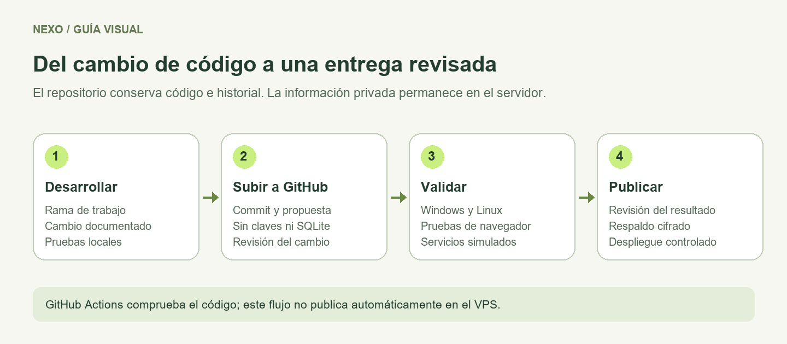

# Manual de Git y GitHub para Nexo

## Estado verificado

Destino: **https://github.com/metodomogollondev/nexo** (público). Se prepara el historial local y el flujo de GitHub Actions. La cuenta conectada `dafermen` tiene permiso de lectura; el primer envío y la primera ejecución en Actions quedan pendientes hasta obtener escritura. No confundir preparación local con publicación completada.

## Conceptos básicos

| Concepto | Significado práctico |
|---|---|
| Git | Historial de versiones guardado en su computadora |
| GitHub | Servicio donde puede alojar el repositorio y revisar trabajo |
| Commit | Un conjunto coherente de cambios guardados en el historial |
| Rama | Una línea de trabajo para desarrollar una tarea |
| Pull request | Una propuesta de cambios para revisar antes de integrar |
| Issue | Una necesidad, error o tarea con un resultado esperado |
| Actions | Automatizaciones de GitHub; prepararlas no significa haberlas ejecutado |

## Primera preparación local

Después de decidir que esta carpeta será el repositorio:

```powershell
Set-Location C:\Projects\Nexo
git init -b main
git status
```

Revise `.gitignore`. Nexo excluye `.env`, bases de datos locales, `.local`, `runtime`, dependencias y cobertura. El archivo de ejemplo de configuración puede versionarse cuando solo contenga ejemplos, nunca valores reales.

Seleccione archivos concretos para el primer commit. Un ejemplo inicial es:

```powershell
git add README.md package.json .gitignore public server scripts tests docs conocimiento
git diff --cached --stat
git diff --cached
git commit -m "chore: registrar base local de Nexo"
```

Incluya también los archivos de arranque revisados que se quieran mantener. Antes del commit, compruebe licencias de imágenes, modelos y librerías vendorizadas. Los scripts no deben contener claves.

GitHub permite importar un proyecto local mediante Git, GitHub CLI o GitHub Desktop. Para una primera publicación desde Git, cree un repositorio vacío y use su URL real; no adivine una dirección. [Guía oficial de importación](https://docs.github.com/en/migrations/importing-source-code/using-the-command-line-to-import-source-code/adding-locally-hosted-code-to-github).

```powershell
# Sustituya el texto de ejemplo por la URL del repositorio elegido.
git remote add origin URL_REAL_DEL_REPOSITORIO
git remote -v
git push -u origin main
```

El último comando publica el historial en el remoto configurado. Se documenta aquí; no se ha ejecutado como parte de este portal.

## Trabajo cotidiano

Cuando ya exista un repositorio y un remoto:

1. Compruebe `git status` y preserve cualquier cambio pendiente.
2. Actualice la rama base con `git pull --ff-only` cuando esté limpia y corresponda.
3. Cree una rama para una tarea, por ejemplo `git switch -c mejora/faq-horarios`.
4. Implemente la tarea y ejecute las pruebas pertinentes.
5. Revise el diff, seleccione archivos y guarde un commit explicativo.
6. Suba la rama y abra un pull request.
7. Integre después de revisar la evidencia y resolver observaciones.

## Qué escribir en un pull request

```text
Problema: qué ocurre y a quién afecta.
Cambio: qué comportamiento queda disponible.
Validación: comandos y recorridos realmente ejecutados.
Pendientes: datos, dispositivos o dependencias que faltan.
Documentación: tarea y guía actualizadas.
```

Use títulos concretos: «Conservar el curso al pedir su precio» explica más que «Mejoras varias».

## Revisión y protección

En un repositorio compartido pueden exigirse revisiones y comprobaciones antes de integrar, además de restringir cambios directos a la rama principal. La disponibilidad depende de la cuenta y del tipo de repositorio. [Ramas protegidas](https://docs.github.com/en/repositories/configuring-branches-and-merges-in-your-repository/managing-protected-branches/about-protected-branches).

La protección de push puede detectar determinados secretos antes de que lleguen al repositorio, pero no sustituye la revisión del contenido. Si se filtra una credencial, debe revocarse y reemplazarse; borrar la línea del último archivo no la elimina del historial. [Protección de secretos](https://docs.github.com/en/code-security/concepts/secret-security/push-protection).

## Integración continua preparada

El archivo `.github/workflows/ci.yml` ejecuta al recibir cambios en main o propuestas de cambio:

1. Node 24 y dependencias fijadas por package-lock.json, sin scripts de instalación.
2. Sintaxis, cobertura de documentación y pruebas unitarias/API en Windows y Linux.
3. Chromium para autenticación, FAQ visual y portal, con proveedores simulados.

No utiliza claves de OpenAI, LiveAvatar, correo ni Google. No despliega por sí solo. Acciones fijadas por revisión, token de solo lectura y tiempo máximo de 15 minutos. Los fallos se consultan en la pestaña Actions del repositorio.

Para impedir integrar cambios con pruebas fallidas, el propietario deberá activar una regla de protección de main y exigir estas comprobaciones. **No está activada por esta entrega.**



## Recuperar un error

Primero revise `git status` y `git diff`. Corrija cambios locales editando los archivos. Para deshacer un cambio ya compartido, prefiera un commit de reversión revisado. Evite borrar historial o usar push forzado como solución rutinaria.

## SQLite y correo desde v0.13

Incluya package.json, package-lock.json, el código y config/installation.example.json. Excluya .env, config/installation.json, data, .local, respaldos y node_modules. No publique su correo privado de administración ni credenciales SMTP. En un clon nuevo ejecute npm ci. [Instalación](31-sqlite-acceso-correo.md).
