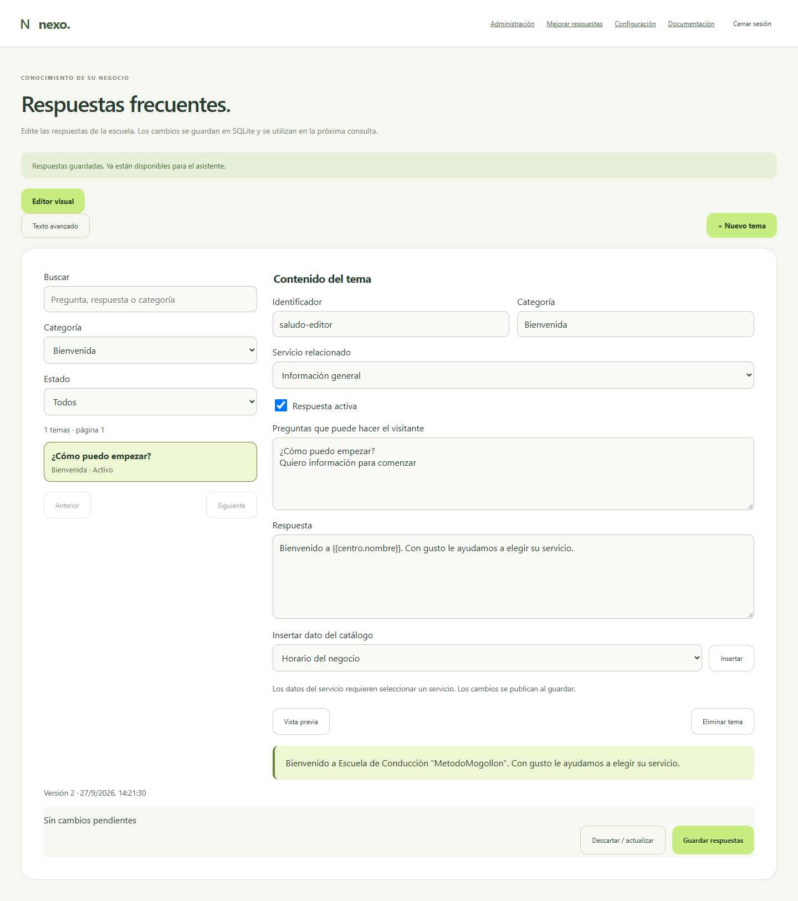

# Editor visual de preguntas frecuentes y entrega con GitHub

Versión 0.33.0 · 27 de septiembre de 2026.

## Para quien mantiene las respuestas

Entre a **Administración → Respuestas frecuentes** con su código de correo. La pantalla inicial es el editor visual; Texto avanzado conserva el formato anterior. La base escolar activa se guarda en SQLite. El archivo `conocimiento/preguntas-frecuentes.txt` es una semilla para instalaciones nuevas, no sobrescribe la información existente al desplegar.



La captura usa un tema de demostración, no una conversación ni datos personales reales.

1. Busque un tema existente o pulse **Nuevo tema**.
2. Escriba una categoría, por ejemplo «Clases prácticas» o «Documentos». Sirve para organizar el panel; no determina qué responde el agente.
3. Seleccione el servicio si la respuesta necesita su precio, duración o requisitos.
4. Añada variantes de preguntas, una por línea, y una respuesta breve. Máximo 20 variantes por tema y 1.500 caracteres de respuesta.
5. Use **Insertar dato del catálogo**: `{{servicio.precio}}` se calcula con el precio vigente. No copie un precio fijo si debe actualizarse junto con el catálogo.
6. Pulse **Vista previa**. Resuelve datos sin llamar a IA ni modificar la base. No simula toda la conversación ni certifica que una pregunta ambigua será reconocida.
7. Pulse **Guardar respuestas** para publicar el conjunto de cambios. Un aviso confirma el resultado. No hay guardado automático.

**Respuesta activa** permite pausar un tema sin eliminarlo. **Eliminar tema** solo afecta el borrador hasta guardar. Hay búsqueda, filtros por categoría/estado y páginas de 30 temas. Las respuestas existentes sin categoría aparecen en «General».


## Ejemplo con precio actualizado

Seleccione la clase práctica y escriba:

```text
La clase práctica cuesta {{servicio.precio}} y dura {{servicio.duracion}}.
```

Si Administración cambia el precio del servicio, la siguiente respuesta y la vista previa usan el nuevo valor. Un precio escrito literalmente se mantiene hasta editarlo. No se generan precios, requisitos o condiciones que no estén registrados.

No coloque nombres de alumnos, correos, códigos de citas, claves ni información confidencial en las FAQs: son respuestas destinadas a los visitantes. Las traducciones y el comportamiento conversacional siguen las reglas existentes de idioma; las categorías no traducen automáticamente contenido nuevo. Revise español, inglés y francés con la escuela.

## Si hay un error

- **Otra ventana modificó las respuestas:** se conserva su borrador. Copie lo que necesite y use Descartar / actualizar para cargar la versión publicada; vuelva a aplicar el cambio. El sistema no mezcla borradores automáticamente.
- **Parámetro desconocido:** use el selector de datos del catálogo. Los parámetros de servicio requieren un servicio seleccionado.
- **Base no activa:** revise Configuración → Asistente. El editor visual corresponde a la base escolar; las respuestas propias de otro negocio siguen en Configuración.
- **Tema o servicio pausado:** la vista previa lo advierte; no significa que se ofrecerá al visitante.
- **Sesión vencida:** vuelva a autenticarse. Por privacidad, el borrador se limpia al cerrar sesión o tras cinco minutos sin actividad.

Texto avanzado y editor visual representan la misma información. Al convertir desde visual se reconstruyen los bloques: los comentarios del archivo de texto no se conservan. El servidor aplica la misma validación a ambos modos.

## Para un desarrollador junior: recorrido del código

| Componente | Entrada | Resultado / responsabilidad |
|---|---|---|
| `public/knowledge.html` y `.css` | Tamaño de pantalla y estado de controles | Formulario accesible, lista, filtros y vista previa |
| `public/knowledge.js` | Eventos del administrador y respuesta de API | Borrador en memoria, paginación y peticiones autenticadas |
| `server/faq-editor.js` | Temas estructurados no confiables | Serialización validada y vista previa sin efectos externos |
| `server/faq.js` | Texto FAQ y catálogo | Validación de campos y resolución de parámetros |
| `server/app.js` | Peticiones HTTP | Autorización, límites, revisión y persistencia |
| `server/sqlite-faq.js` | Revisión publicada en SQLite | Recarga del índice usado por el asistente |

Variables importantes del navegador: `entries` contiene el borrador; `selected` es el índice editado; `page` controla la lista; `dirty` avisa de cambios no guardados; `generation` descarta respuestas que llegaron después de cerrar sesión; `previewGeneration` evita mostrar una vista previa de un tema que ya cambió. `revision` acompaña el guardado para detectar edición simultánea.

### Contratos HTTP, todos protegidos

| Ruta | Entrada | Salida |
|---|---|---|
| GET `/api/admin/knowledge` | Sesión administrativa | Texto, revisión, temas, catálogo y fuente activa |
| POST `/api/admin/knowledge/parse` | `entries` o `source` | Formato y temas validados; no guarda |
| POST `/api/admin/knowledge/preview` | `entry` | Texto resuelto y advertencia opcional; no guarda |
| PUT `/api/admin/knowledge` | `revision` más `entries` o `source` | Base publicada; 409 si la revisión cambió |

El backend rechaza bloques inyectados mediante saltos de línea, parámetros desconocidos, identificadores duplicados y límites excedidos. La vista previa se muestra con `textContent`, nunca como HTML. No se almacena el acceso ni el borrador en localStorage.

## GitHub y pruebas automáticas

Repositorio solicitado: [metodomogollondev/nexo](https://github.com/metodomogollondev/nexo). Es público. La cuenta conectada tiene lectura; la publicación requiere que el propietario conceda escritura a `dafermen`. Esta guía distingue lo preparado de una ejecución remota efectivamente completada.


El flujo `.github/workflows/ci.yml` comprueba sintaxis, documentación y pruebas en Windows/Linux con Node 24. Otro trabajo ejecuta Chromium para acceso administrativo, editor visual y portal. Todos esos recorridos utilizan datos ficticios y proveedores simulados. No necesitan secretos ni consumen LiveAvatar/OpenAI. El despliegue en el VPS sigue siendo una operación controlada con respaldo previo.

El propietario puede exigir comprobaciones exitosas antes de integrar mediante las reglas de protección de main. Tener el archivo del flujo no activa por sí solo esa protección.

### Validación local

```text
npm ci --ignore-scripts
npm run check
npm run docs:check
npm test
npm run test:faq-editor
npm run test:access
npm run test:docs
```

Las pruebas de navegador requieren Playwright y Chromium, o `PLAYWRIGHT_MODULE` apuntando a una instalación externa. `BROWSER_CHANNEL=msedge` permite utilizar Edge instalado en Windows. Estos ejecutables no forman parte del servidor productivo.

Los casos nuevos cubren categorías, compatibilidad del texto, precios vigentes, autorización, borradores inválidos, publicación y conflictos. El navegador valida formularios, filtros, vista previa, pausa, cambio entre modos, contenido HTML tratado como texto, ancho móvil y limpieza de datos al salir.

## Qué se guarda en Git y qué se respalda

Git conserva código, pruebas, dependencias declaradas, documentación e imágenes didácticas. `.gitignore` excluye `.env`, instalación real, bases, audios generados, conversaciones, logs, respaldos y claves. Un clon nuevo necesita su configuración privada y su propia base; el historial de Git no sustituye el respaldo cifrado de SQLite.

Pendientes fuera de esta entrega: importación masiva con conciliación de temas, editor visual para respuestas propias de negocios genéricos, revisión formal de traducciones y prueba física en kiosco. Consulte [fases y tareas](25-fases-y-tareas.md) y [manual de GitHub](24-manual-github.md).
